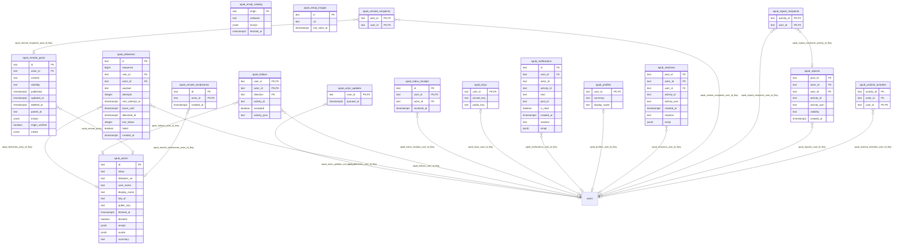

# DB の ER 図: activitypub

ActivityPub(apub_*)。[一覧に戻る](../db-erd.md)

`infra/db/schema.sql` から自動生成しています。直接編集しないでください。

```mermaid
erDiagram
    apub_actor_updates {
      text user_id PK,FK
      timestamptz queued_at
    }
    apub_actor_updates |o--o| users : apub_actor_updates_user_id_fkey
    apub_actors {
      text id PK
      text inbox
      text followers_url
      text user_name
      text display_name
      text key_id
      text public_key
      timestamptz fetched_at
      boolean blocked
      jsonb emojis
      jsonb avatar
      text summary
    }
    apub_deliveries {
      text id PK
      bigint sequence
      text user_id FK
      text actor_id FK
      text payload
      integer attempts
      timestamptz next_attempt_at
      timestamptz lease_until
      timestamptz delivered_at
      integer last_status
      boolean failed
      timestamptz created_at
    }
    apub_deliveries }o--o| apub_actors : apub_deliveries_actor_id_fkey
    apub_deliveries }o--o| users : apub_deliveries_user_id_fkey
    apub_emoji_catalog {
      text origin PK
      text software
      jsonb emojis
      timestamptz fetched_at
    }
    apub_emoji_images {
      text id PK
      text url
      timestamptz last_seen_at
    }
    apub_follows {
      text user_id PK,FK
      text actor_id PK,FK
      text direction PK
      text activity_id
      boolean accepted
      text activity_json
    }
    apub_follows }o--o| apub_actors : apub_follows_actor_id_fkey
    apub_follows }o--o| users : apub_follows_user_id_fkey
    apub_inbox_receipts {
      text id PK
      text user_id PK,FK
      text actor_id PK
      timestamptz received_at
    }
    apub_inbox_receipts }o--o| users : apub_inbox_receipts_user_id_fkey
    apub_keys {
      text user_id PK,FK
      text private_key
      text public_key
    }
    apub_keys |o--o| users : apub_keys_user_id_fkey
    apub_notifications {
      text id PK
      text user_id FK
      text actor_id
      text activity_id
      text kind
      text post_id
      boolean is_read
      timestamptz created_at
      text reaction
      jsonb emoji
    }
    apub_notifications }o--o| users : apub_notifications_user_id_fkey
    apub_profiles {
      text user_id PK,FK
      text summary
      text display_name
    }
    apub_profiles |o--o| users : apub_profiles_user_id_fkey
    apub_reactions {
      text post_id PK
      text actor_id PK
      text user_id FK
      text activity_id
      text activity_json
      timestamptz created_at
      text reaction
      jsonb emoji
    }
    apub_reactions }o--o| users : apub_reactions_user_id_fkey
    apub_remote_posts {
      text id PK
      text actor_id FK
      text content
      text visibility
      timestamptz published
      timestamptz updated_at
      timestamptz deleted_at
      text parent_id
      jsonb emojis
      boolean origin_verified
      jsonb media
    }
    apub_remote_posts }o--o| apub_actors : apub_remote_posts_actor_id_fkey
    apub_remote_recipients {
      text post_id PK,FK
      text user_id PK,FK
    }
    apub_remote_recipients }o--o| apub_remote_posts : apub_remote_recipients_post_id_fkey
    apub_remote_recipients }o--o| users : apub_remote_recipients_user_id_fkey
    apub_remote_tombstones {
      text id PK
      text actor_id PK,FK
      timestamptz created_at
    }
    apub_remote_tombstones }o--o| apub_actors : apub_remote_tombstones_actor_id_fkey
    apub_repost_recipients {
      text activity_id PK,FK
      text user_id PK,FK
    }
    apub_repost_recipients }o--o| apub_reposts : apub_repost_recipients_activity_id_fkey
    apub_repost_recipients }o--o| users : apub_repost_recipients_user_id_fkey
    apub_reposts {
      text post_id PK
      text actor_id PK
      text user_id FK
      text activity_id
      text activity_json
      text visibility
      timestamptz created_at
    }
    apub_reposts }o--o| users : apub_reposts_user_id_fkey
    apub_undone_activities {
      text activity_id PK
      text actor_id PK
      text user_id PK,FK
    }
    apub_undone_activities }o--o| users : apub_undone_activities_user_id_fkey
```
