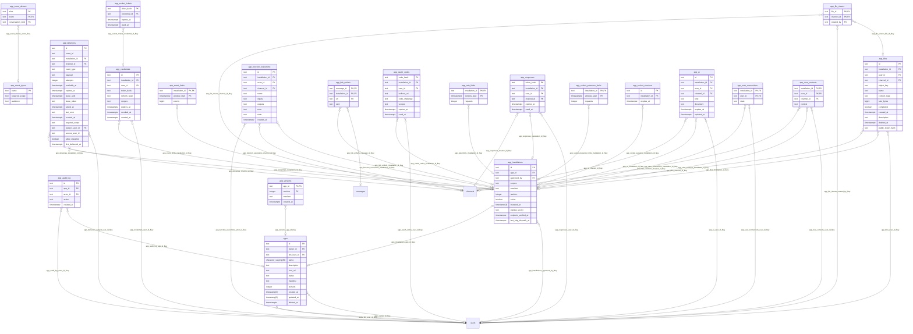

# DB の ER 図: apps

アプリ連携(apps と app_*)。[一覧に戻る](../db-erd.md)

`infra/db/schema.sql` から自動生成しています。直接編集しないでください。

```mermaid
erDiagram
    app_audit_log {
      text id PK
      text app_id FK
      text actor_id FK
      text action
      timestamptz created_at
    }
    app_audit_log }o--o| users : app_audit_log_actor_id_fkey
    app_audit_log }o--o| apps : app_audit_log_app_id_fkey
    app_credentials {
      text id PK
      text installation_id FK
      text user_id FK
      text token_hash
      text refresh_hash
      text scopes
      timestamptz expires_at
      timestamptz revoked_at
      timestamptz created_at
    }
    app_credentials }o--o| app_installations : app_credentials_installation_id_fkey
    app_credentials }o--o| users : app_credentials_user_id_fkey
    app_deliveries {
      text id PK
      text event_id
      text installation_id FK
      text channel_id FK
      text event_type
      text payload
      integer attempts
      timestamptz available_at
      timestamptz expires_at
      timestamptz lease_until
      text lease_token
      timestamptz acked_at
      text last_error
      timestamptz created_at
      text required_scope
      text subject_user_id FK
      text access_user_id
      boolean allow_departed
      timestamptz first_delivered_at
    }
    app_deliveries }o--o| channels : app_deliveries_channel_id_fkey
    app_deliveries }o--o| app_installations : app_deliveries_installation_id_fkey
    app_deliveries }o--o| users : app_deliveries_subject_user_id_fkey
    app_event_aliases {
      text alias PK
      text event PK,FK
      text conversation_kind PK
    }
    app_event_aliases }o--o| app_event_types : app_event_aliases_event_fkey
    app_event_limits {
      text installation_id PK,FK
      timestamptz window_start PK
      bigint events
    }
    app_event_limits }o--o| app_installations : app_event_limits_installation_id_fkey
    app_event_types {
      text name PK
      text required_scope
      text audience
    }
    app_file_shares {
      text file_id PK,FK
      text channel_id PK,FK
      text created_by FK
    }
    app_file_shares }o--o| channels : app_file_shares_channel_id_fkey
    app_file_shares }o--o| users : app_file_shares_created_by_fkey
    app_file_shares }o--o| app_files : app_file_shares_file_id_fkey
    app_files {
      text id PK
      text installation_id FK
      text user_id FK
      text channel_id FK
      text object_key
      text name
      text content_type
      bigint size_bytes
      boolean completed
      timestamptz created_at
      text description
      timestamptz deleted_at
      text public_token_hash
    }
    app_files }o--o| channels : app_files_channel_id_fkey
    app_files }o--o| app_installations : app_files_installation_id_fkey
    app_files }o--o| users : app_files_user_id_fkey
    app_function_executions {
      text id PK
      text installation_id FK
      text actor_id FK
      text channel_id FK
      text name
      text inputs
      text outputs
      text error
      text state
      timestamptz created_at
    }
    app_function_executions }o--o| users : app_function_executions_actor_id_fkey
    app_function_executions }o--o| channels : app_function_executions_channel_id_fkey
    app_function_executions }o--o| app_installations : app_function_executions_installation_id_fkey
    app_installations {
      text id PK
      text app_id FK
      text approved_by FK
      text scopes
      text manifest
      integer revision
      boolean active
      timestamp(3) installed_at
      text signing_secret
      timestamptz endpoint_verified_at
      timestamptz last_http_dispatch_at
    }
    app_installations |o--o| apps : app_installations_app_id_fkey
    app_installations }o--o| users : app_installations_approved_by_fkey
    app_link_unfurls {
      text message_id PK,FK
      text installation_id PK,FK
      text url PK
      text card
    }
    app_link_unfurls }o--o| app_installations : app_link_unfurls_installation_id_fkey
    app_link_unfurls }o--o| messages : app_link_unfurls_message_id_fkey
    app_oauth_codes {
      text code_hash PK
      text installation_id FK
      text user_id FK
      text redirect_uri
      text code_challenge
      text scopes
      timestamptz expires_at
      timestamptz used_at
    }
    app_oauth_codes }o--o| app_installations : app_oauth_codes_installation_id_fkey
    app_oauth_codes }o--o| users : app_oauth_codes_user_id_fkey
    app_rate_limits {
      text installation_id PK,FK
      timestamptz window_start PK
      integer requests
    }
    app_rate_limits }o--o| app_installations : app_rate_limits_installation_id_fkey
    app_responses {
      text token_hash PK
      text installation_id FK
      text user_id FK
      text channel_id FK
      timestamptz expires_at
      timestamptz used_at
    }
    app_responses }o--o| channels : app_responses_channel_id_fkey
    app_responses }o--o| app_installations : app_responses_installation_id_fkey
    app_responses }o--o| users : app_responses_user_id_fkey
    app_socket_presence_limits {
      text installation_id PK,FK
      timestamptz window_start PK
      integer requests
    }
    app_socket_presence_limits }o--o| app_installations : app_socket_presence_limits_installation_id_fkey
    app_socket_sessions {
      text id PK
      text installation_id FK
      timestamptz expires_at
    }
    app_socket_sessions }o--o| app_installations : app_socket_sessions_installation_id_fkey
    app_socket_tickets {
      text ticket_hash PK
      text credential_id FK
      timestamptz expires_at
      timestamptz used_at
    }
    app_socket_tickets }o--o| app_credentials : app_socket_tickets_credential_id_fkey
    app_ui {
      text id PK
      text installation_id FK
      text user_id FK
      text channel_id FK
      text kind
      text document
      timestamptz expires_at
      timestamptz updated_at
    }
    app_ui }o--o| channels : app_ui_channel_id_fkey
    app_ui }o--o| app_installations : app_ui_installation_id_fkey
    app_ui }o--o| users : app_ui_user_id_fkey
    app_user_connections {
      text installation_id PK,FK
      text user_id PK,FK
      text state
    }
    app_user_connections }o--o| app_installations : app_user_connections_installation_id_fkey
    app_user_connections }o--o| users : app_user_connections_user_id_fkey
    app_versions {
      text app_id PK,FK
      integer revision PK
      text manifest
      timestamptz created_at
    }
    app_versions }o--o| apps : app_versions_app_id_fkey
    app_view_contexts {
      text installation_id PK,FK
      text user_id PK,FK
      text channel_id FK
      text context
    }
    app_view_contexts }o--o| channels : app_view_contexts_channel_id_fkey
    app_view_contexts }o--o| app_installations : app_view_contexts_installation_id_fkey
    app_view_contexts }o--o| users : app_view_contexts_user_id_fkey
    apps {
      text id PK
      text owner_id FK
      text bot_user_id FK
      character_varying(80) name
      text description
      text icon_url
      text status
      text manifest
      integer revision
      timestamp(3) created_at
      timestamp(3) updated_at
      timestamptz deleted_at
    }
    apps |o--o| users : apps_bot_user_id_fkey
    apps }o--o| users : apps_owner_id_fkey
```
