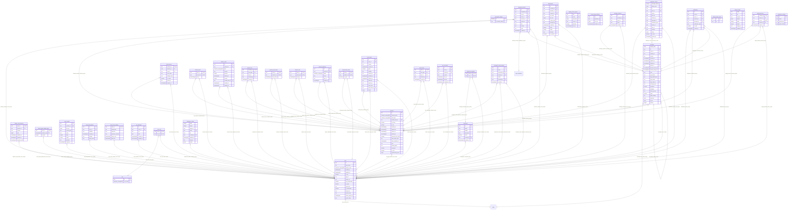

# DB の ER 図: core

コア(ユーザー、チャンネル、メッセージ、通知など)。[一覧に戻る](../db-erd.md)

`infra/db/schema.sql` から自動生成しています。直接編集しないでください。

```mermaid
erDiagram
    activitypub_settings {
      boolean id PK
      text ltl_channel_pattern
    }
    assistant_sessions {
      text id PK
      text installation_id FK
      text user_id FK
      text actor_id FK
      text channel_id FK
      text parent_id FK
      text title
      text context
      text state
      timestamptz created_at
    }
    assistant_sessions }o--o| users : assistant_sessions_actor_id_fkey
    assistant_sessions }o--o| channels : assistant_sessions_channel_id_fkey
    assistant_sessions }o--o| app_installations : assistant_sessions_installation_id_fkey
    assistant_sessions }o--o| messages : assistant_sessions_parent_id_fkey
    assistant_sessions }o--o| users : assistant_sessions_user_id_fkey
    attachments {
      text id PK
      text message_id FK
      text uploader_id FK
      text channel_id FK
      text file_name
      bigint file_size
      text content_type
      text storage_key
      timestamp(3) created_at
      integer width
      integer height
      text blurhash
      boolean is_sensitive
    }
    attachments }o--o| channels : attachments_channel_id_fkey
    attachments }o--o| messages : attachments_message_id_fkey
    attachments }o--o| users : attachments_uploader_id_fkey
    bubble_chat_presence {
      text user_id PK,FK
      text session_id PK
      text content
      bigint seq
      timestamptz updated_at
      timestamptz expires_at
      timestamptz retention_until
    }
    bubble_chat_presence }o--o| users : bubble_chat_presence_user_id_fkey
    call_presence {
      text channel_id PK,FK
      uuid session_id PK
      text user_id FK
      text user_name
      text display_name
      boolean is_muted
      text joined_at
      timestamptz expires_at
    }
    call_presence }o--o| channels : call_presence_channel_id_fkey
    call_presence }o--o| users : call_presence_user_id_fkey
    channel_leave {
      text user_id PK,FK
      text channel_id PK,FK
      timestamp(3) left_at
    }
    channel_leave }o--o| channels : channel_leave_channel_id_fkey
    channel_leave }o--o| users : channel_leave_user_id_fkey
    channel_notes {
      text id PK
      text channel_id FK
      character_varying(200) title
      text content
      integer position
      timestamp(3) deleted_at
      integer version
      text created_user_id FK
      timestamp(3) created_at
      timestamp(3) updated_at
    }
    channel_notes }o--o| channels : channel_notes_channel_id_fkey
    channel_notes }o--o| users : channel_notes_created_user_id_fkey
    channel_pins {
      text channel_id PK,FK
      text item_type PK
      text item_id PK
      text created_by FK
      timestamptz created_at
    }
    channel_pins }o--o| channels : channel_pins_channel_id_fkey
    channel_pins }o--o| users : channel_pins_created_by_fkey
    channel_read_states {
      text user_id PK,FK
      text channel_id PK,FK
      timestamp(3) last_read_at
    }
    channel_read_states }o--o| channels : channel_read_states_channel_id_fkey
    channel_read_states }o--o| users : channel_read_states_user_id_fkey
    channel_user {
      text user_id PK,FK
      text channel_id PK,FK
      timestamp(3) joined_at
    }
    channel_user }o--o| channels : channel_user_channel_id_fkey
    channel_user }o--o| users : channel_user_user_id_fkey
    channel_webhooks {
      text id PK
      text channel_id FK
      character_varying(80) name
      text secret
      text user_id FK
      timestamp(3) created_at
    }
    channel_webhooks }o--o| channels : channel_webhooks_channel_id_fkey
    channel_webhooks }o--o| users : channel_webhooks_user_id_fkey
    channels {
      text id PK
      character_varying(255) channel_name
      character_varying(255) description
      text created_user_id FK
      boolean is_private
      boolean is_dm
      timestamp(3) created_at
      timestamp(3) updated_at
      timestamp(3) archive_at
      timestamp(3) deleted_at
      boolean imported_from_slack
      text slack_import_kind
      timestamp(3) slack_imported_at
      text topic
      text posting_policy
      boolean encrypted
      boolean is_nsfw
      bigint membership_epoch
    }
    channels }o--o| users : channels_created_user_id_fkey
    conversation_views {
      text user_id PK,FK
      text channel_id PK,FK
      boolean is_open
    }
    conversation_views }o--o| channels : conversation_views_channel_id_fkey
    conversation_views }o--o| users : conversation_views_user_id_fkey
    display_refresh_queue {
      text kind PK
      text target PK
      bigint generation PK
      text cursor_id
      integer attempts
      timestamptz retry_at
    }
    home_image_deletions {
      text id PK
      text uploader_id
      bigint file_size
      timestamptz created_at
    }
    home_image_upload_rates {
      text user_id PK,FK
      timestamptz window_start PK
      integer requests
    }
    home_image_upload_rates }o--o| users : home_image_upload_rates_user_id_fkey
    home_images {
      text id PK
      text uploader_id FK
      bigint file_size
      text content_type
      text name
      integer width
      integer height
      text blurhash
      timestamptz created_at
    }
    home_images }o--o| users : home_images_uploader_id_fkey
    home_posts {
      text id PK
      text user_id FK
      text content
      timestamptz created_at
      boolean apub
      text visibility
      text channel_id FK
      timestamptz updated_at
      timestamptz deleted_at
      text parent_id
      text parent_uri
      text reply_actor
      text reply_user_id FK
      jsonb media
    }
    home_posts }o--o| channels : home_posts_channel_id_fkey
    home_posts }o--o| users : home_posts_reply_user_id_fkey
    home_posts }o--o| users : home_posts_user_id_fkey
    message_reactions {
      text id PK
      text message_id FK
      text user_id FK
      text emoji
      timestamp(3) created_at
    }
    message_reactions }o--o| messages : message_reactions_message_id_fkey
    message_reactions }o--o| users : message_reactions_user_id_fkey
    messages {
      jsonb display_data
      text id PK
      text user_id FK
      text channel_id FK
      text content
      timestamp(3) created_at
      timestamp(3) updated_at
      timestamp(3) deleted_at
      text parent_id FK
      timestamp(3) thread_archive_at
      timestamp(3) thread_activity_at
      text card
      text app_blocks
      text app_attachments
      text app_unfurls
      text app_origin_id FK
      text message_kind
      boolean broadcast
      text metadata
      text home_post_id
      boolean apub
      text apub_visibility
      jsonb ciphertext
      bigint epoch
      integer revision
    }
    messages }o--o| apps : messages_app_origin_id_fkey
    messages }o--o| channels : messages_channel_id_fkey
    messages }o--o| messages : messages_parent_id_fkey
    messages }o--o| users : messages_user_id_fkey
    notification_events {
      boolean message_deleted
      jsonb display_data
      text id PK
      text user_id FK
      text source
      text actor_id
      text channel_id FK
      text message_id FK
      text notification_type
      text activity_id
      text post_id
      text reaction
      jsonb emoji
      boolean is_read
      timestamp created_at
    }
    notification_events }o--o| channels : notification_events_channel_id_fkey
    notification_events }o--o| messages : notification_events_message_id_fkey
    notification_events }o--o| users : notification_events_user_id_fkey
    notifications {
      text id PK
      text user_id FK
      text actor_id FK
      text channel_id FK
      text message_id FK
      text notification_type
      boolean is_read
      timestamp(3) created_at
    }
    notifications }o--o| users : notifications_actor_id_fkey
    notifications }o--o| channels : notifications_channel_id_fkey
    notifications }o--o| messages : notifications_message_id_fkey
    notifications }o--o| users : notifications_user_id_fkey
    push_subscriptions {
      text id PK
      text user_id FK
      text endpoint
      timestamp(3) created_at
      text p256dh
      text auth_secret
    }
    push_subscriptions }o--o| users : push_subscriptions_user_id_fkey
    role {
      text id PK
      character_varying(255) role_name
    }
    saved_items {
      text user_id PK,FK
      text item_type PK
      text item_id PK
      text channel_id FK
      timestamptz created_at
    }
    saved_items }o--o| channels : saved_items_channel_id_fkey
    saved_items }o--o| users : saved_items_user_id_fkey
    shared_emoji_source {
      text id PK
      text url
    }
    shared_emojis {
      text name PK
      text url
      text category
      jsonb aliases
      integer width
      integer height
      text image_id
      timestamptz updated_at
    }
    typing_presence {
      text channel_id PK,FK
      text parent_id FK
      text user_id PK,FK
      text session_id PK
      timestamptz expires_at
    }
    typing_presence }o--o| channels : typing_presence_channel_id_fkey
    typing_presence }o--o| messages : typing_presence_parent_id_fkey
    typing_presence }o--o| users : typing_presence_user_id_fkey
    user_event_settings {
      text user_id PK,FK
      text preferences
      text presence
      text presence_override
      timestamptz active_until
      timestamptz dnd_until
    }
    user_event_settings |o--o| users : user_event_settings_user_id_fkey
    user_identities {
      text id PK
      text user_id FK
      text iss
      text sub
      timestamp(3) created_at
      timestamp(3) updated_at
    }
    user_identities }o--o| users : user_identities_user_id_fkey
    user_reminders {
      text id PK
      text user_id FK
      text channel_id FK
      text content
      timestamptz due_at
      timestamptz fired_at
      timestamptz completed_at
    }
    user_reminders }o--o| channels : user_reminders_channel_id_fkey
    user_reminders }o--o| users : user_reminders_user_id_fkey
    user_role {
      text user_id PK,FK
      text role_id PK,FK
    }
    user_role }o--o| role : user_role_role_id_fkey
    user_role }o--o| users : user_role_user_id_fkey
    usergroup_members {
      text group_id PK,FK
      text user_id PK,FK
    }
    usergroup_members }o--o| usergroups : usergroup_members_group_id_fkey
    usergroup_members }o--o| users : usergroup_members_user_id_fkey
    usergroups {
      text id PK
      text name
      text handle
      text description
      boolean active
      text created_by FK
      timestamptz created_at
    }
    usergroups }o--o| users : usergroups_created_by_fkey
    users {
      text id PK
      text user_name
      character_varying(255) display_name
      timestamp(3) created_at
      timestamp(3) updated_at
      boolean is_bot
      text app_id FK
      text avatar_url
      boolean bot_mentionable
      boolean is_guest
      text guest_kind
      boolean is_deactivated
      text status_text
      text status_emoji
      timestamptz status_expires_at
      text profile_fields
    }
    users }o--o| apps : users_app_id_fkey
    workspace_emojis {
      integer width
      integer height
      text image_id
      text name PK
      text url
      text created_by FK
      timestamptz updated_at
      text category
      jsonb aliases
    }
    workspace_emojis }o--o| users : workspace_emojis_created_by_fkey
    workspace_invite_requests {
      text id PK
      text email
      text requested_by FK
      text channel_id FK
      text status
      text resolved_by FK
      timestamptz created_at
    }
    workspace_invite_requests }o--o| channels : workspace_invite_requests_channel_id_fkey
    workspace_invite_requests }o--o| users : workspace_invite_requests_requested_by_fkey
    workspace_invite_requests }o--o| users : workspace_invite_requests_resolved_by_fkey
    workspace_settings {
      text id PK
      text name
      text preferences
      text profile_fields
    }
```
