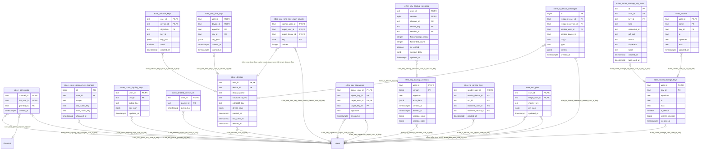

# DB の ER 図: e2ee

E2EE(e2ee_*)。[一覧に戻る](../db-erd.md)

`infra/db/schema.sql` から自動生成しています。直接編集しないでください。

```mermaid
erDiagram
    e2ee_bot_grants {
      text channel_id PK,FK
      text bot_user_id PK,FK
      text granted_by FK
      timestamptz created_at
    }
    e2ee_bot_grants }o--o| users : e2ee_bot_grants_bot_user_id_fkey
    e2ee_bot_grants }o--o| channels : e2ee_bot_grants_channel_id_fkey
    e2ee_bot_grants }o--o| users : e2ee_bot_grants_granted_by_fkey
    e2ee_cross_signing_key_changes {
      bigint id PK
      text user_id FK
      text usage
      text old_public_key
      text new_public_key
      timestamptz changed_at
    }
    e2ee_cross_signing_key_changes }o--o| users : e2ee_cross_signing_key_changes_user_id_fkey
    e2ee_cross_signing_keys {
      text user_id PK,FK
      text usage PK
      text public_key
      jsonb key_json
      timestamptz updated_at
    }
    e2ee_cross_signing_keys }o--o| users : e2ee_cross_signing_keys_user_id_fkey
    e2ee_deleted_device_ids {
      text user_id PK,FK
      text device_id PK
      timestamptz deleted_at
    }
    e2ee_deleted_device_ids }o--o| users : e2ee_deleted_device_ids_user_id_fkey
    e2ee_devices {
      text user_id PK,FK
      text device_id PK
      text display_name
      text curve25519_key
      text ed25519_key
      jsonb device_keys
      timestamptz created_at
      timestamptz last_seen_at
      timestamptz deleted_at
    }
    e2ee_devices }o--o| users : e2ee_devices_user_id_fkey
    e2ee_fallback_keys {
      text user_id PK,FK
      text device_id PK,FK
      text algorithm PK
      text key_id
      jsonb key_json
      boolean used
      timestamptz created_at
    }
    e2ee_fallback_keys }o--o| e2ee_devices : e2ee_fallback_keys_user_id_device_id_fkey
    e2ee_key_backup_sessions {
      text user_id PK,FK
      bigint version PK,FK
      text channel_id PK
      text sender_key PK
      text session_id PK
      integer first_message_index
      integer forwarded_count
      boolean is_verified
      jsonb session_data
      timestamptz updated_at
    }
    e2ee_key_backup_sessions }o--o| e2ee_key_backup_versions : e2ee_key_backup_sessions_user_id_version_fkey
    e2ee_key_backup_versions {
      text user_id PK,FK
      bigint version PK
      text algorithm
      jsonb auth_data
      timestamptz created_at
      timestamptz deleted_at
      bigint session_count
      bigint session_bytes
    }
    e2ee_key_backup_versions }o--o| users : e2ee_key_backup_versions_user_id_fkey
    e2ee_key_signatures {
      text signer_user_id PK,FK
      text signer_key_id PK
      text target_user_id PK,FK
      text target_key_id PK
      text signature
      timestamptz created_at
    }
    e2ee_key_signatures }o--o| users : e2ee_key_signatures_signer_user_id_fkey
    e2ee_key_signatures }o--o| users : e2ee_key_signatures_target_user_id_fkey
    e2ee_one_time_key_claim_counts {
      text claimer_user_id PK,FK
      text target_user_id PK,FK
      text target_device_id PK,FK
      date day PK
      integer claimed
    }
    e2ee_one_time_key_claim_counts }o--o| e2ee_devices : e2ee_one_time_key_claim_count_target_user_id_target_device_fkey
    e2ee_one_time_key_claim_counts }o--o| users : e2ee_one_time_key_claim_counts_claimer_user_id_fkey
    e2ee_one_time_keys {
      text user_id PK,FK
      text device_id PK,FK
      text algorithm PK
      text key_id PK
      jsonb key_json
      timestamptz created_at
      timestamptz claimed_at
    }
    e2ee_one_time_keys }o--o| e2ee_devices : e2ee_one_time_keys_user_id_device_id_fkey
    e2ee_secret_storage_key_slots {
      text id PK
      text user_id FK
      text key_id FK
      text kind
      text credential_id
      text prf_salt
      text nonce
      text ciphertext
      text label
      timestamptz created_at
      timestamptz last_used_at
    }
    e2ee_secret_storage_key_slots |o--o| e2ee_secret_storage_keys : e2ee_secret_storage_key_slots_user_id_key_id_fkey
    e2ee_secret_storage_keys {
      text user_id PK,FK
      text key_id PK
      text algorithm
      text iv
      text mac
      boolean is_default
      bigint secrets_revision
      timestamptz created_at
    }
    e2ee_secret_storage_keys |o--o| users : e2ee_secret_storage_keys_user_id_fkey
    e2ee_secrets {
      text user_id PK,FK
      text name PK
      text key_id FK
      text iv
      text ciphertext
      text mac
      timestamptz updated_at
    }
    e2ee_secrets }o--o| e2ee_secret_storage_keys : e2ee_secrets_user_id_key_id_fkey
    e2ee_to_device_messages {
      bigint id PK
      text recipient_user_id FK
      text recipient_device_id FK
      text sender_user_id FK
      text sender_device_id
      text txn_id
      text type
      jsonb content
      timestamptz created_at
    }
    e2ee_to_device_messages }o--o| e2ee_devices : e2ee_to_device_messages_recipient_user_id_recipient_device_fkey
    e2ee_to_device_messages }o--o| users : e2ee_to_device_messages_sender_user_id_fkey
    e2ee_to_device_txns {
      text sender_user_id PK,FK
      text sender_device_id PK
      text txn_id PK
      text recipient_user_id PK
      text recipient_device_id PK
      timestamptz created_at
    }
    e2ee_to_device_txns }o--o| users : e2ee_to_device_txns_sender_user_id_fkey
    e2ee_tofu_pins {
      text user_id PK,FK
      text target_user_id PK,FK
      text master_key
      jsonb pin_json
      timestamptz updated_at
    }
    e2ee_tofu_pins }o--o| users : e2ee_tofu_pins_target_user_id_fkey
    e2ee_tofu_pins }o--o| users : e2ee_tofu_pins_user_id_fkey
```
