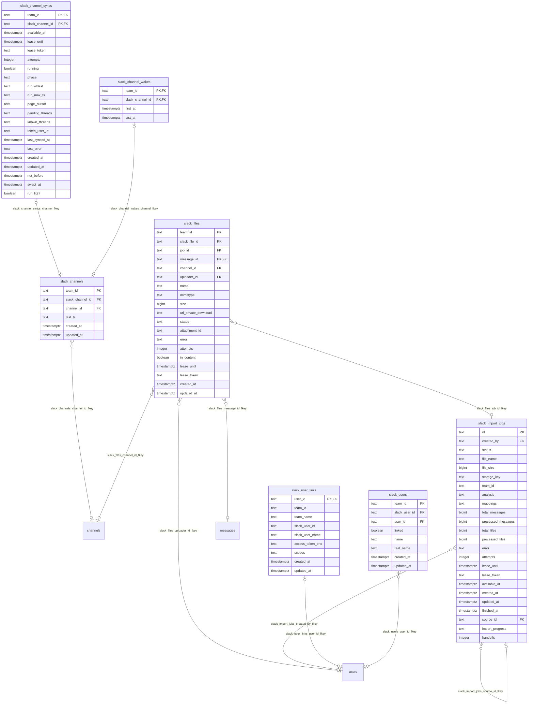

# DB の ER 図: slack

Slack 取り込み(slack_*)。[一覧に戻る](../db-erd.md)

`infra/db/schema.sql` から自動生成しています。直接編集しないでください。

```mermaid
erDiagram
    slack_channel_syncs {
      text team_id PK,FK
      text slack_channel_id PK,FK
      timestamptz available_at
      timestamptz lease_until
      text lease_token
      integer attempts
      boolean running
      text phase
      text run_oldest
      text run_max_ts
      text page_cursor
      text pending_threads
      text known_threads
      text token_user_id
      timestamptz last_synced_at
      text last_error
      timestamptz created_at
      timestamptz updated_at
      timestamptz not_before
      timestamptz swept_at
      boolean run_light
    }
    slack_channel_syncs |o--o| slack_channels : slack_channel_syncs_channel_fkey
    slack_channel_wakes {
      text team_id PK,FK
      text slack_channel_id PK,FK
      timestamptz first_at
      timestamptz last_at
    }
    slack_channel_wakes |o--o| slack_channels : slack_channel_wakes_channel_fkey
    slack_channels {
      text team_id PK
      text slack_channel_id PK
      text channel_id FK
      text last_ts
      timestamptz created_at
      timestamptz updated_at
    }
    slack_channels }o--o| channels : slack_channels_channel_id_fkey
    slack_files {
      text team_id PK
      text slack_file_id PK
      text job_id FK
      text message_id PK,FK
      text channel_id FK
      text uploader_id FK
      text name
      text mimetype
      bigint size
      text url_private_download
      text status
      text attachment_id
      text error
      integer attempts
      boolean in_content
      timestamptz lease_until
      text lease_token
      timestamptz created_at
      timestamptz updated_at
    }
    slack_files }o--o| channels : slack_files_channel_id_fkey
    slack_files }o--o| slack_import_jobs : slack_files_job_id_fkey
    slack_files }o--o| messages : slack_files_message_id_fkey
    slack_files }o--o| users : slack_files_uploader_id_fkey
    slack_import_jobs {
      text id PK
      text created_by FK
      text status
      text file_name
      bigint file_size
      text storage_key
      text team_id
      text analysis
      text mappings
      bigint total_messages
      bigint processed_messages
      bigint total_files
      bigint processed_files
      text error
      integer attempts
      timestamptz lease_until
      text lease_token
      timestamptz available_at
      timestamptz created_at
      timestamptz updated_at
      timestamptz finished_at
      text source_id FK
      text import_progress
      integer handoffs
    }
    slack_import_jobs }o--o| users : slack_import_jobs_created_by_fkey
    slack_import_jobs }o--o| slack_import_jobs : slack_import_jobs_source_id_fkey
    slack_user_links {
      text user_id PK,FK
      text team_id
      text team_name
      text slack_user_id
      text slack_user_name
      text access_token_enc
      text scopes
      timestamptz created_at
      timestamptz updated_at
    }
    slack_user_links |o--o| users : slack_user_links_user_id_fkey
    slack_users {
      text team_id PK
      text slack_user_id PK
      text user_id FK
      boolean linked
      text name
      text real_name
      timestamptz created_at
      timestamptz updated_at
    }
    slack_users }o--o| users : slack_users_user_id_fkey
```
